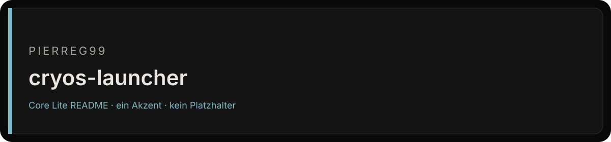

<div align="center">



# cryos-launcher

cryOS — CryDroid Launcher OS: fully virtualized phone launcher + CryLinux desktop simulation. One law, many ices.

[](https://github.com/Pierreg99/cryos-launcher)
[](https://github.com/Pierreg99/cryos-launcher)
[](https://github.com/Pierreg99/cryos-launcher)

</div>

<table>
<tr>
<td width="58%" valign="top">

### Bestand

cryOS — CryDroid Launcher OS: fully virtualized phone launcher + CryLinux desktop simulation. One law, many ices.

Der Default-Branch `main` ist die Fläche, die zählt. Was nicht in diesem Baum liegt, ist kein Feature dieses Repos.

</td>
<td width="42%" valign="top">

### Fakten

| Feld | Wert |
| --- | --- |
| Owner | Pierreg99 |
| Branch | `main` |
| Sichtbarkeit | öffentlich |
| Sprache | TypeScript |
| Archiv | nein |

</td>
</tr>
</table>

## Lesen

1. Default-Branch öffnen.
2. Nur Dateien in diesem Baum als Beleg nehmen.
3. Issues und Diskussionen nur nutzen, wenn sie im Repo eingeschaltet sind.

## Grenze

Keine Qualitätszahl, kein Paketstand und keine Runtime, die nicht als Datei in diesem Repo steht.

<p align="center"><sub>Fläche nach Cryo Core Lite v1.5 · Tokens #0A0A0A / #141414 / #7EB8C9</sub></p>


<details>
<summary>Bisheriger README-Text</summary>

# CryDroid Launcher OS

**One law, many ices.** A fully virtualized, browser-based phone launcher
simulation in the spirit of [`Pierreg99/cryOS`](https://github.com/Pierreg99/cryOS) —
not a website with a dock sticker, a session.

Boot → Lock → Home, with gesture navigation, a notification shade, an app
drawer and ten mock apps — plus a second virtual device mode: the
**CryLinux desktop** (CryArch / crybuntu / crybian / Crynux) with a window
manager, taskbar/dock and start menu. English and German. No emoji.
TypeScript strict, no `any`.

**One law, many ices.** Switch ice from Settings; the law does not change.
Crydroid boots the phone launcher; desktop ices boot a full-bleed desktop
on screens ≥ 900 px (phone shell falls back on narrow screens). Each ice
carries its own accent and hex-mark glyph — same law, different chrome.

> UI/UX simulation only — no real Android APIs, no native launcher package.
> For demo, portfolio and interactive-storytelling purposes.

**Live demo:** https://pierreg99.github.io/cryos-launcher/ (GitHub Pages,
static export — desktop mode needs a window ≥ 900 px)

## Run it

```bash
npm install
npm run dev        # http://localhost:3000
```

Production:

```bash
npm run build
npm run start
npm run typecheck  # tsc --noEmit (strict)
npm run smoke      # headless store logic tests (71 checks)
```

On wide screens the OS renders inside a 19.5:9 phone frame; on phones it
fills the viewport edge-to-edge. Mouse and touch both work everywhere.

## Gesture map

| Gesture | Action |
|---|---|
| Tap during boot (after first beat) | Skip boot |
| Swipe up / tap on lock screen | Thaw (unlock) |
| Swipe up (bottom edge), in app / drawer / recents | Home |
| Swipe up (bottom edge), on home screen | App drawer |
| Swipe up and hold (or hold the pill ≥ 400 ms) | Recents card stack |
| Tap the gesture pill | Home |
| Swipe inward from left/right edge | Back (folder → shade → drawer → recents → app) |
| Swipe down from top edge / tap status bar | Notification shade |
| Long-press or drag an icon | Rearrange grid / dock; drop on an app = folder |
| Swipe a recents card up | Dismiss app |
| Swipe a notification right | Dismiss notification |

### Desktop mode (desktop ices, wide screens)

| Input | Action |
|---|---|
| Taskbar start button (distro mark) | App menu (search, grid, ice footer, lock session) |
| Click desktop icon / menu app | Open app as window (single instance, cascading placement) |
| Drag title bar | Move window (clamped to the desktop) |
| Drag edges / corners | 8-way resize (min 260×180) |
| Double-click title bar / maximize button | Maximize ⇄ restore |
| Minimize button / taskbar click (focused app) | Minimize to taskbar |
| Click a window / taskbar click (unfocused) | Focus (raise z-order) |
| Close button | Close window |
| Click empty desktop | Minimize all windows (per the session contract) |
| Drag window to screen edge / corner | Snap: left/right half, top = full usable area, corners = quadrants (live preview) |
| Drag a maximized window by its title | Restores under the pointer, OS-style |
| Escape | Close app menu / CryCenter |
| Tray | CryCenter button, dark-mode quick toggle, radio + battery mocks, clock (opens Clock) |

### CryCenter (desktop)

Opened from the tray (distro-mark button, unread dot): control center
(WLAN, Bluetooth, dark mode, airplane, parallax, brightness), **ice
switcher** ("Switch ice from CryCenter or Settings"), lock session, and —
split below the controls — the notification list. The phone keeps its
notification shade; both share the same controls and notification state.

## Modules (per agent brief)

1. **Boot sequence** — hex mark, wordmark, ice name, epigraph, loading bar;
   duration configurable (0.8–6 s, Settings); skippable via tap after the
   first beat (420 ms).
2. **Lock screen** — clock, date, frost weather mock, super wallpaper;
   swipe-up unlock (dy < −72 px) or tap; optional **PIN mock** (purely
   visual — any 4 digits thaw; enable in Settings).
3. **Home / launcher** — 4×5 app grid with pointer-based **drag & drop**,
   **folders** (create by dropping app-on-app, drag out, auto-collapse),
   5-slot **dock** (drag between dock and grid), **wallpaper engine**
   (3 pure-CSS wallpapers + rAF-lerped pointer **parallax**), widget slot
   (clock + weather mock + word of the cycle).
4. **Gesture navigation** — single native pointer tracker
   (`useSystemGestures`) for home / recents / back / shade + visual gesture
   pill; **recents** = horizontal snap card stack with swipe-up dismiss and
   clear-all.
5. **Status bar & notification shade** — ice name, unread bell, live clock,
   WLAN/Bluetooth/airplane/signal/battery mocks; shade with drag-to-close
   handle, quick-settings tiles (WLAN, Bluetooth, **Dark Mode — real global
   theme state**, Airplane, Parallax), brightness slider (real dimming veil)
   and 4 dismissible mock notifications.
6. **App drawer** — all mock apps, live search, category chips
   (Doctrine / System / Everyday), alphabetical letter sections.
7. **Phase 2 — ices + CryLinux desktop mode** (extension, after phone
   acceptance): crybel distro registry (5 ices, frozen names, per-ice
   accent + mark glyph), ice switch in Settings (persisted), ice-aware
   boot/lock/status chrome, `use-desktop-layout` routing, desktop session
   (wallpaper, pinned desktop icons, live clock widget), window manager
   (drag / 8-way resize / min / max-restore / close / click-to-focus /
   single instance, session-only state), taskbar-dock with running
   indicators and tray, searchable start menu with lock.
8. **Phase 3 — snap, CryCenter, offline** (approved extension): window
   snapping/tiling (edge halves, corner quadrants, top full-area, live
   preview, drag-out of maximize), desktop **CryCenter** (control center
   split from notifications + ice switcher + lock, shared controls with
   the phone shade), and the **offline service worker** (network-first
   navigations, cache-first hashed assets, SWR elsewhere; registered in
   production builds only) completing the installable PWA.

Mock apps: CryBel, Family, Manifest, DNA (frozen doctrine), Device (Super
Device bus), Files (CryIndex walker), CryPaper (persisted notes), CryoLan
(terminal: `help`, `ices`, `creed`, `cryform`, `cycle`, `clear`), Clock
(analog frost), Settings (real, persisted controls incl. layout reset and
lock-now).

## Persistence

`zustand` + `persist` → `localStorage` key `crydroid-shell-v1`
(settings incl. the active ice, grid, dock, dismissed notifications,
notes). Desktop window state is session-only — every boot starts clean. Session state
(stage, recents, open app) intentionally resets — every reload boots.
The theme is mirrored to `crydroid-theme` and applied by a pre-paint
inline script (no FOUC; Tailwind `dark:` variant via `@custom-variant`).

## Structure (mirrors the reference repo)

```
src/
  app/            layout (pre-paint theme script), page, globals.css, manifest, icon
  components/     boot-screen, lock-screen, pin-pad, gesture-bar, wallpaper,
                  status-bar, notification-shade, home-screen, widget-slot,
                  app-grid, dock, folder-popover, app-drawer, recents-screen,
                  app-window, session, launcher-os, phone-frame, distro-mark,
                  apps/ (app-content, settings, clock, terminal, notes, files,
                         device, doctrine),
                  desktop/ (desktop-os, desktop-window, desktop-taskbar,
                            desktop-app-menu, desktop-crycenter,
                            desktop-icons, desktop-clock-widget),
                  qs-controls (shared quick settings + notifications)
  hooks/          use-now, use-hydrated, use-theme, use-media-query,
                  use-parallax, use-gestures, use-slot-drag,
                  use-desktop-layout, use-service-worker
  lib/            apps, live, wallpapers, doctrine, crybel, desktop
                  (incl. snap geometry), utils
  store/          shell.ts (stag

… gekürzt, Original bleibt in der Git-Historie.

</details>
